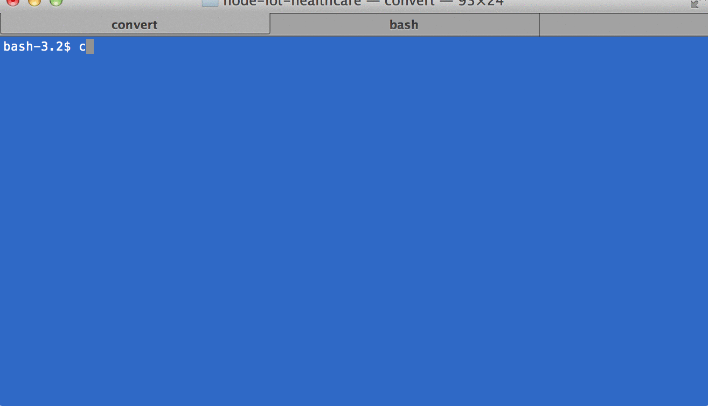

Node-IoT-HealthCare
===================

node.js lib for fitness and health tracking devices.



###Pre-Requisites

iojs v2.1.0

```sh
npm install -g babel
```
### Setup
```sh
npm install 
```

### Build
```sh
npm run prepublish
```

### Test
```sh
npm run test
```

### Run
```sh
babel-node --stage 0 -- test.js
```

### Debug
```sh
babel-node --debug --stage 0 -- test.js --debug
```
